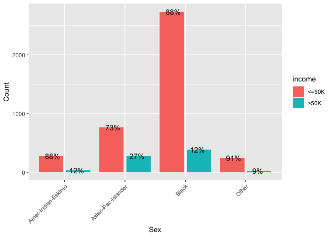

Adult Dataset
================

``` r
# importing the required libraries
suppressPackageStartupMessages(library(tidyverse))
```

In this R Markdown document, I will be doing a preliminary data analysis and exploration for the [adult dataset from UCI ML datasets repository](https://archive.ics.uci.edu/ml/datasets/Adult).

Section 1: Reading and Cleaning up the dataset
----------------------------------------------

``` r
# reading the dataset
adult <- read.csv("data/adult.data", header = FALSE)
test <- read.csv("data/adult.test", header = FALSE, skip = 1)

head(adult)
```

    ##   V1                V2     V3         V4 V5                  V6
    ## 1 39         State-gov  77516  Bachelors 13       Never-married
    ## 2 50  Self-emp-not-inc  83311  Bachelors 13  Married-civ-spouse
    ## 3 38           Private 215646    HS-grad  9            Divorced
    ## 4 53           Private 234721       11th  7  Married-civ-spouse
    ## 5 28           Private 338409  Bachelors 13  Married-civ-spouse
    ## 6 37           Private 284582    Masters 14  Married-civ-spouse
    ##                   V7             V8     V9     V10  V11 V12 V13
    ## 1       Adm-clerical  Not-in-family  White    Male 2174   0  40
    ## 2    Exec-managerial        Husband  White    Male    0   0  13
    ## 3  Handlers-cleaners  Not-in-family  White    Male    0   0  40
    ## 4  Handlers-cleaners        Husband  Black    Male    0   0  40
    ## 5     Prof-specialty           Wife  Black  Female    0   0  40
    ## 6    Exec-managerial           Wife  White  Female    0   0  40
    ##              V14    V15
    ## 1  United-States  <=50K
    ## 2  United-States  <=50K
    ## 3  United-States  <=50K
    ## 4  United-States  <=50K
    ## 5           Cuba  <=50K
    ## 6  United-States  <=50K

We see that there are 14 features and 1 response which is binary (whether the annual income is &lt;= or greater than 50k).

``` r
# assigning proper column names to variables
adult <- adult %>%
    magrittr::set_colnames(c("age", "workclass", "fnlwgt", "education", "education_num",
                             "marital_status", "occupation", "relationship", "race",
                             "sex", "capital_gain", "capital_loss", "hours_per_week",
                             "native_country", "income"))
head(adult)
```

    ##   age         workclass fnlwgt  education education_num
    ## 1  39         State-gov  77516  Bachelors            13
    ## 2  50  Self-emp-not-inc  83311  Bachelors            13
    ## 3  38           Private 215646    HS-grad             9
    ## 4  53           Private 234721       11th             7
    ## 5  28           Private 338409  Bachelors            13
    ## 6  37           Private 284582    Masters            14
    ##        marital_status         occupation   relationship   race     sex
    ## 1       Never-married       Adm-clerical  Not-in-family  White    Male
    ## 2  Married-civ-spouse    Exec-managerial        Husband  White    Male
    ## 3            Divorced  Handlers-cleaners  Not-in-family  White    Male
    ## 4  Married-civ-spouse  Handlers-cleaners        Husband  Black    Male
    ## 5  Married-civ-spouse     Prof-specialty           Wife  Black  Female
    ## 6  Married-civ-spouse    Exec-managerial           Wife  White  Female
    ##   capital_gain capital_loss hours_per_week native_country income
    ## 1         2174            0             40  United-States  <=50K
    ## 2            0            0             13  United-States  <=50K
    ## 3            0            0             40  United-States  <=50K
    ## 4            0            0             40  United-States  <=50K
    ## 5            0            0             40           Cuba  <=50K
    ## 6            0            0             40  United-States  <=50K

Now that we have imported the data in the required format, we will move on to looking at the dataset and cleaning it wherever required.

``` r
# looking at the structure of the data
str(adult)
```

    ## 'data.frame':    32561 obs. of  15 variables:
    ##  $ age           : int  39 50 38 53 28 37 49 52 31 42 ...
    ##  $ workclass     : Factor w/ 9 levels " ?"," Federal-gov",..: 8 7 5 5 5 5 5 7 5 5 ...
    ##  $ fnlwgt        : int  77516 83311 215646 234721 338409 284582 160187 209642 45781 159449 ...
    ##  $ education     : Factor w/ 16 levels " 10th"," 11th",..: 10 10 12 2 10 13 7 12 13 10 ...
    ##  $ education_num : int  13 13 9 7 13 14 5 9 14 13 ...
    ##  $ marital_status: Factor w/ 7 levels " Divorced"," Married-AF-spouse",..: 5 3 1 3 3 3 4 3 5 3 ...
    ##  $ occupation    : Factor w/ 15 levels " ?"," Adm-clerical",..: 2 5 7 7 11 5 9 5 11 5 ...
    ##  $ relationship  : Factor w/ 6 levels " Husband"," Not-in-family",..: 2 1 2 1 6 6 2 1 2 1 ...
    ##  $ race          : Factor w/ 5 levels " Amer-Indian-Eskimo",..: 5 5 5 3 3 5 3 5 5 5 ...
    ##  $ sex           : Factor w/ 2 levels " Female"," Male": 2 2 2 2 1 1 1 2 1 2 ...
    ##  $ capital_gain  : int  2174 0 0 0 0 0 0 0 14084 5178 ...
    ##  $ capital_loss  : int  0 0 0 0 0 0 0 0 0 0 ...
    ##  $ hours_per_week: int  40 13 40 40 40 40 16 45 50 40 ...
    ##  $ native_country: Factor w/ 42 levels " ?"," Cambodia",..: 40 40 40 40 6 40 24 40 40 40 ...
    ##  $ income        : Factor w/ 2 levels " <=50K"," >50K": 1 1 1 1 1 1 1 2 2 2 ...

``` r
summary(adult)
```

    ##       age                    workclass         fnlwgt       
    ##  Min.   :17.00    Private         :22696   Min.   :  12285  
    ##  1st Qu.:28.00    Self-emp-not-inc: 2541   1st Qu.: 117827  
    ##  Median :37.00    Local-gov       : 2093   Median : 178356  
    ##  Mean   :38.58    ?               : 1836   Mean   : 189778  
    ##  3rd Qu.:48.00    State-gov       : 1298   3rd Qu.: 237051  
    ##  Max.   :90.00    Self-emp-inc    : 1116   Max.   :1484705  
    ##                  (Other)          :  981                    
    ##          education     education_num                  marital_status 
    ##   HS-grad     :10501   Min.   : 1.00    Divorced             : 4443  
    ##   Some-college: 7291   1st Qu.: 9.00    Married-AF-spouse    :   23  
    ##   Bachelors   : 5355   Median :10.00    Married-civ-spouse   :14976  
    ##   Masters     : 1723   Mean   :10.08    Married-spouse-absent:  418  
    ##   Assoc-voc   : 1382   3rd Qu.:12.00    Never-married        :10683  
    ##   11th        : 1175   Max.   :16.00    Separated            : 1025  
    ##  (Other)      : 5134                    Widowed              :  993  
    ##             occupation            relationship  
    ##   Prof-specialty :4140    Husband       :13193  
    ##   Craft-repair   :4099    Not-in-family : 8305  
    ##   Exec-managerial:4066    Other-relative:  981  
    ##   Adm-clerical   :3770    Own-child     : 5068  
    ##   Sales          :3650    Unmarried     : 3446  
    ##   Other-service  :3295    Wife          : 1568  
    ##  (Other)         :9541                          
    ##                   race            sex         capital_gain  
    ##   Amer-Indian-Eskimo:  311    Female:10771   Min.   :    0  
    ##   Asian-Pac-Islander: 1039    Male  :21790   1st Qu.:    0  
    ##   Black             : 3124                   Median :    0  
    ##   Other             :  271                   Mean   : 1078  
    ##   White             :27816                   3rd Qu.:    0  
    ##                                              Max.   :99999  
    ##                                                             
    ##   capital_loss    hours_per_week         native_country     income     
    ##  Min.   :   0.0   Min.   : 1.00    United-States:29170    <=50K:24720  
    ##  1st Qu.:   0.0   1st Qu.:40.00    Mexico       :  643    >50K : 7841  
    ##  Median :   0.0   Median :40.00    ?            :  583                 
    ##  Mean   :  87.3   Mean   :40.44    Philippines  :  198                 
    ##  3rd Qu.:   0.0   3rd Qu.:45.00    Germany      :  137                 
    ##  Max.   :4356.0   Max.   :99.00    Canada       :  121                 
    ##                                   (Other)       : 1709

We see that there are missing values in 3 columns (in the form of `?`) looking at the structure of data. There also seems to be whitespace as a prefix in many of the categorical variables. We also don't need the final weight variable which was put up by the Census Board and hence, will remove it. Let us handle all these cases.

``` r
adult <- adult %>%
    mutate(income = str_trim(income, side = c("left")),
           occupation = ifelse(occupation == " ?", "unknown", as.character(occupation)),
           workclass = ifelse(workclass == " ?", "unknown", as.character(workclass)),
           native_country = ifelse(native_country == " ?", "unknown", as.character(native_country)),
           workclass = str_trim(workclass, side = c("left")),
           education = str_trim(education, side = c("left")),
           marital_status = str_trim(marital_status, side = c("left")),
           occupation = str_trim(occupation, side = c("left")),
           relationship = str_trim(relationship, side = c("left")),
           sex = str_trim(sex, side = c("left")),
           race = str_trim(race, side = c("left")),
           native_country = str_trim(native_country, side = c("left")))
head(adult)
```

    ##   age        workclass fnlwgt education education_num     marital_status
    ## 1  39        State-gov  77516 Bachelors            13      Never-married
    ## 2  50 Self-emp-not-inc  83311 Bachelors            13 Married-civ-spouse
    ## 3  38          Private 215646   HS-grad             9           Divorced
    ## 4  53          Private 234721      11th             7 Married-civ-spouse
    ## 5  28          Private 338409 Bachelors            13 Married-civ-spouse
    ## 6  37          Private 284582   Masters            14 Married-civ-spouse
    ##          occupation  relationship  race    sex capital_gain capital_loss
    ## 1      Adm-clerical Not-in-family White   Male         2174            0
    ## 2   Exec-managerial       Husband White   Male            0            0
    ## 3 Handlers-cleaners Not-in-family White   Male            0            0
    ## 4 Handlers-cleaners       Husband Black   Male            0            0
    ## 5    Prof-specialty          Wife Black Female            0            0
    ## 6   Exec-managerial          Wife White Female            0            0
    ##   hours_per_week native_country income
    ## 1             40  United-States  <=50K
    ## 2             13  United-States  <=50K
    ## 3             40  United-States  <=50K
    ## 4             40  United-States  <=50K
    ## 5             40           Cuba  <=50K
    ## 6             40  United-States  <=50K

``` r
# checking missing value category
adult %>%
    filter(is.na(workclass)) %>%
    group_by(income) %>%
    count()
```

    ## # A tibble: 0 x 2
    ## # Groups:   income [0]
    ## # ... with 2 variables: income <chr>, n <int>

``` r
adult %>%
    filter(is.na(occupation)) %>%
    group_by(income) %>%
    count()
```

    ## # A tibble: 0 x 2
    ## # Groups:   income [0]
    ## # ... with 2 variables: income <chr>, n <int>

``` r
adult %>%
    filter(is.na(native_country)) %>%
    group_by(income) %>%
    count()
```

    ## # A tibble: 0 x 2
    ## # Groups:   income [0]
    ## # ... with 2 variables: income <chr>, n <int>

We see that most of the people with missing values in the above 3 columns belong to the &lt;50K income category and since we have a lot of data points for that category, we can safely ignore these cases from our analysis.

``` r
adult <- adult %>%
    filter(!is.na(workclass), !is.na(occupation), !is.na(native_country))
```

Section 2: Univariate Analysis
------------------------------

``` r
adult %>%
    keep(is.numeric) %>%                     # Keep only numeric columns
    gather() %>%                             # Convert to key-value pairs
    ggplot(aes(value)) +                     # Plot the values
    facet_wrap(~ key, scales = "free") +     # In separate panels
    geom_histogram(color = "darkblue",
                   fill = "lightblue", bins = 25) +
    ggtitle("Histograms for numeric variables") +
    theme_bw()
```


The age and final weight distributions seem to be right-skewed and a log/square-root transformation on these would be a good choice while building the model. Plotting `capital_gain` and `capital_loss` without the 0 value would give a better look at the distribution.

``` r
adult %>%
    select(capital_gain) %>%
    filter(capital_gain != 0) %>%
    ggplot() +
    geom_histogram(aes(x = capital_gain), color = "darkblue",
                   fill = "lightblue", bins = 25) +
    ggtitle("Histogram for capital gain") +
    theme_bw()
```


``` r
adult %>%
    select(capital_loss) %>%
    filter(capital_loss != 0) %>%
    ggplot() +
    geom_histogram(aes(x = capital_loss), color = "darkblue",
                   fill = "lightblue", bins = 25) +
    ggtitle("Histogram for capital loss") +
    theme_bw()
```


We see that there is a set of people with a very high capital gain (about a 100000) and the rest of the people form a right-skewed distribution. I suspect that these people with such a high capital gain would fall into the category of &gt;50K income bracket. Let's find out!

``` r
adult %>%
    filter(capital_gain > 90000) %>%
    group_by(income) %>%
    count()
```

    ## # A tibble: 1 x 2
    ## # Groups:   income [1]
    ##   income     n
    ##   <chr>  <int>
    ## 1 >50K     159

As expected, they are indeed a high-income group! Capital gain might be good predictor of income group. Let us now look at the distribution of some categorical variables.

``` r
adult %>%
    select(-income) %>%
    keep(is.character) %>%
    gather() %>%
    ggplot(aes(value)) +
    facet_wrap(~ key, scales = "free", ncol = 4) +
    geom_bar(color = "darkblue", fill = "lightblue") +
    theme(axis.text.x = element_text(angle = 90, hjust = 1))
```


Let us plot separately some figures which are not so clear in the picture above and break them down into actual numbers.

``` r
# native country
adult %>%
    group_by(native_country) %>%
    summarise(freq = n()) %>%
    mutate(prop = freq / sum(freq) * 100) %>%
    arrange(desc(prop))
```

    ## # A tibble: 42 x 3
    ##    native_country  freq   prop
    ##    <chr>          <int>  <dbl>
    ##  1 United-States  29170 89.6  
    ##  2 Mexico           643  1.97 
    ##  3 unknown          583  1.79 
    ##  4 Philippines      198  0.608
    ##  5 Germany          137  0.421
    ##  6 Canada           121  0.372
    ##  7 Puerto-Rico      114  0.350
    ##  8 El-Salvador      106  0.326
    ##  9 India            100  0.307
    ## 10 Cuba              95  0.292
    ## # ... with 32 more rows

Most of the people in the dataset are from the United-States.

``` r
# workclass
adult %>%
    group_by(workclass) %>%
    summarise(freq = n()) %>%
    mutate(prop = freq / sum(freq) * 100) %>%
    arrange(desc(prop))
```

    ## # A tibble: 9 x 3
    ##   workclass         freq    prop
    ##   <chr>            <int>   <dbl>
    ## 1 Private          22696 69.7   
    ## 2 Self-emp-not-inc  2541  7.80  
    ## 3 Local-gov         2093  6.43  
    ## 4 unknown           1836  5.64  
    ## 5 State-gov         1298  3.99  
    ## 6 Self-emp-inc      1116  3.43  
    ## 7 Federal-gov        960  2.95  
    ## 8 Without-pay         14  0.0430
    ## 9 Never-worked         7  0.0215

As we see, most of the people belong to the `Private` workforce. Let us remake this plot so as to look at other classes clearly.

``` r
# distribution without private workclass
adult %>%
    filter(workclass != "Private") %>%
    ggplot() +
    geom_bar(aes(x = workclass), color = "darkblue",
                   fill = "lightblue") +
    ggtitle("Bar plot for Workclass") +
    theme_bw()
```


There are very less people who have never worked or who are living without a pay. We will now move on to multivariate analysis.

Section 3: Multivariate Analysis
--------------------------------

In this section, we will be analyzing the relationship between different predictors and the response along with some relationships and patterns within the predictors.

``` r
adult %>%
    ggplot() +
    geom_violin(aes(x = income, y = age)) +
    geom_boxplot(aes(x = income, y = age), width=0.05) +
    geom_hline(yintercept = 35, color = "red") +
    geom_hline(yintercept = 50, color = "red") +
    theme_bw()
```


We see that most of the population under the age of 25 earns &lt; 50K a year. This makes sense and most likely, this section of the population would not be earning much at all (as there will be a lot of students in this section). Most of the people who earn &gt; 50K a year are in their 30s and 40s.

``` r
adult %>%
    group_by(education, income) %>%
    summarise(freq = n()) %>%
    mutate(prop = freq / sum(freq) * 100) %>%
    filter(income == ">50K") %>%
    arrange(desc(prop)) %>%
    ggplot() +
    geom_col(aes(x = reorder(education, prop), y = prop), color = "darkblue",
                   fill = "lightblue") +
    labs(x = "Education Level", y = "Percentage") +
    theme(axis.text.x = element_text(angle = 45, hjust = 1))
```


No surprise here! Adults with a high level of education have a higher proportion of people who earn more than 50K a year. There also are some people with a low education level who are earning &gt; 50K per year. Let us have a closer look at these people.

``` r
adult %>%
    filter(education_num < 8, income == ">50K") %>%
    group_by(workclass) %>%
    count() %>%
    ggplot() +
    geom_col(aes(x = reorder(workclass, n), y = n), color = "darkblue",
                   fill = "lightblue") +
    labs(x = "Work class", y = "Count") +
    theme(axis.text.x = element_text(angle = 45, hjust = 1))
```


``` r
adult %>%
    filter(education_num < 8, income == ">50K") %>%
    group_by(education) %>%
    count() %>%
    ggplot() +
    geom_col(aes(x = reorder(education, n), y = n), color = "darkblue",
                   fill = "lightblue") +
    labs(x = "Education level", y = "Count") +
    theme(axis.text.x = element_text(angle = 45, hjust = 1))
```


These people are mostly high-school dropouts who worked for private companies or were self-employed.

``` r
adult %>%
    filter(education_num < 8, income == ">50K") %>%
    group_by(sex) %>%
    count()
```

    ## # A tibble: 2 x 2
    ## # Groups:   sex [2]
    ##   sex        n
    ##   <chr>  <int>
    ## 1 Female    19
    ## 2 Male     192

Not surprisingly, most of these people are males (10:1 male-female ratio). We don't see many cases of women dropping out from schools and earning really high amounts of money. This probably reflects that men are more prone to risk taking than most women.

``` r
# proportion of high earning people by occupation
adult %>%
    group_by(occupation, income) %>%
    summarise(freq = n()) %>%
    mutate(prop = freq / sum(freq) * 100) %>%
    filter(income == ">50K") %>%
    arrange(desc(prop)) %>%
    ggplot() +
    geom_col(aes(x = reorder(occupation, prop), y = prop), color = "darkblue",
                   fill = "lightblue") +
    labs(x = "Occupation", y = "Percentage") +
    theme(axis.text.x = element_text(angle = 45, hjust = 1))
```


``` r
adult %>%
    ggplot() +
    geom_point(aes(x = hours_per_week, y = education_num, color = income)) +
    labs(x = "Working hours per week", y = "Education level") +
    theme_bw()
```


A lot of people who work &gt; 50 hours per week have an income &gt; 50K. Also, there is a bunch of people who don't spend a lot of time working, are really well-educated and earn a high income! They are probably the ones who earn fortunes for a few minutes of their lives.

``` r
adult %>%
    ggplot() +
    geom_jitter(aes(x = marital_status, y = hours_per_week, color = income),
                alpha = 0.1) +
    labs(y = "Hours per week", x = "Marital Status") +
    geom_hline(yintercept = 40, color = "darkgreen") +
    theme(axis.text.x = element_text(angle = 45, hjust = 1))
```


It seems that people who never married are mostly having an income less than 50K a year. Also, most of the people who earn &gt; 50K a year are Married civilians who work &gt; 40 hours per week.

``` r
# distribution of income by race
adult %>%
    ggplot() +
    geom_bar(aes(x = race, fill = income), position = "dodge2") +
    labs(x = "Race") +
    theme(axis.text.x = element_text(angle = 45, hjust = 1))
```


``` r
# distribution of income by race without whites
adult %>%
    group_by(race, income) %>%
    summarise(freq = n()) %>%
    mutate(perc = freq / sum(freq) * 100) %>%
    filter(race != "White") %>%
    ggplot() +
    geom_col(aes(x = race, y = freq, fill = income), position = "dodge2") +
    geom_text(aes(x = race, y = freq, label = paste0(round(perc), "%")),
              size = 4, position = position_dodge2(width = 0.8)) +
    labs(x = "Sex", y = "Count") +
    theme(axis.text.x = element_text(angle = 45, hjust = 1))
```



The ratio of people with an income &gt;50K to the ones with an income &lt;=50K seems to be nearly constant across all races.

``` r
adult %>%
    ggplot() +
    geom_bar(aes(x = race), color = "darkblue",
                   fill = "lightblue") +
    facet_wrap(~ education, scales = "free_y") +
    theme(axis.text.x = element_text(angle = 90, hjust = 1)) +
    labs(x = "Race") +
    ggtitle("Distribution of race by education level")
```


> It is surprising to see the reduced number of black people as compared to whites in the higher level of education categories like `Doctorate`, `Prof-school` and `Masters`. Let us look at the proportion of high earning people by native country.

``` r
# percentage of high earning people by native-country
adult %>%
    group_by(native_country, income) %>%
    summarise(freq = n()) %>%
    mutate(prop = freq / sum(freq) * 100) %>%
    filter(income == ">50K") %>%
    arrange(desc(prop)) %>%
    ggplot() +
    geom_col(aes(x = reorder(native_country, prop), y = prop), color = "darkblue",
                   fill = "lightblue") +
    labs(x = "Native Country", y = "Percentage") +
    coord_flip()
```


The distribution we see above shows that most of the migrants to the United-States are high earning people and there are also many countries whose migrants don't earn a high income. The United-States lies somewhere near the middle of these two categories of countries.

``` r
# distribution of income by sex
adult %>%
    group_by(sex, income) %>%
    summarise(freq = n()) %>%
    mutate(perc = freq / sum(freq) * 100) %>%
    ggplot() +
    geom_col(aes(x = sex, y = freq, fill = income), position = "dodge2") +
    labs(x = "Sex", y = "Count") +
    geom_text(aes(x = sex, y = freq, label = paste0(round(perc), "%")),
              size = 4, position = position_dodge2(width = 0.8)) +
    theme_bw()
```


We see that only 11% of females earn more than 50K a year whereas the percentage is around 3 times higher in males (31%).

Section 4: Data Cleaning
------------------------

``` r
# combining train and test for cleaning and export

test <- test %>%
    magrittr::set_colnames(c("age", "workclass", "fnlwgt", "education", "education_num",
                             "marital_status", "occupation", "relationship", "race",
                             "sex", "capital_gain", "capital_loss", "hours_per_week",
                             "native_country", "income"))

test <- test %>%
    mutate(income = str_trim(income, side = c("left")),
           income = ifelse(income == "<=50K.", "<=50K", ">50K"),
           occupation = ifelse(occupation == " ?", "unknown", as.character(occupation)),
           workclass = ifelse(workclass == " ?", "unknown", as.character(workclass)),
           native_country = ifelse(native_country == " ?", "unknown", as.character(native_country)),
           workclass = str_trim(workclass, side = c("left")),
           education = str_trim(education, side = c("left")),
           marital_status = str_trim(marital_status, side = c("left")),
           occupation = str_trim(occupation, side = c("left")),
           relationship = str_trim(relationship, side = c("left")),
           sex = str_trim(sex, side = c("left")),
           race = str_trim(race, side = c("left")),
           native_country = str_trim(native_country, side = c("left")))

adult <- rbind(adult, test)
```

First, we will combine similar categories in different categorical variables into a smaller number of categories.

``` r
# combining categories in workclass
adult <- adult %>%
    mutate(workclass = replace(workclass, workclass %in% c('State-gov', 'Federal-gov',
                                                 'Local-gov'), 0),
           workclass = replace(workclass, workclass %in% c('Self-emp-not-inc', 'Self-emp-inc',
                                                 'Without-pay', 'Never-worked'), 1),
           workclass = replace(workclass, workclass %in% c('Private'), 2),
           workclass = replace(workclass, workclass %in% c('unknown'), -1))

# combining categories in marital_status
adult <- adult %>%
    mutate(marital_status = replace(marital_status, marital_status %in% c('Married-civ-spouse',
                                                           'Married-spouse-absent',
                                                           'Married-AF-spouse'), 0),
           marital_status = replace(marital_status, marital_status %in% c('Never-married','Divorced',
                                                           'Separated','Widowed'), 1))
# combining categories in education
adult <- adult %>%
    select(-education_num) %>%
    mutate(education = replace(education, education %in% c("HS-grad", "11th", "9th", "7th-8th",
                                                           "5th-6th", "10th", "Preschool", "12th",
                                                           "1st-4th"), 0),
           education = replace(education, education %in% c("Bachelors", "Some-college", "Assoc-acdm",
                                                           "Assoc-voc"), 1),
           education = replace(education, education %in% c("Masters", "Prof-school", "Doctorate",
                                                           "Assoc-voc"), 2))

# combining categories in occupation
adult <- adult %>%
    mutate(occupation = replace(occupation, occupation %in% c("Priv-house-serv", "Handlers-cleaners",
                                                              "Other-service", "Armed-Forces",
                                                              "Machine-op-inspct", "Farming-fishing",
                                                              "Adm-clerical"), 0),
           occupation = replace(occupation, occupation %in% c("Tech-support", "Craft-repair",
                                                              "Protective-serv", "Transport-moving",
                                                              "Sales"), 1),
           occupation = replace(occupation, occupation %in% c("Exec-managerial", "Prof-specialty"), 2),
           occupation = replace(occupation, occupation %in% c("unknown"), -1))

# combining categories in race
adult <- adult %>%
    mutate(race = replace(race, race %in% c("White"), 0),
           race = replace(race, race %in% c("Black"), 1),
           race = replace(race, race %in% c("Asian-Pac-Islander",
                                            "Amer-Indian-Eskimo", "Other"), 2))

# handling sex and native country and target
adult <- adult %>%
    mutate(sex = ifelse(sex == "Male", 1, 0),
           native_country = ifelse(native_country == "United-States", 1, 0),
           income = ifelse(income == "<=50K", 0, 1))

# removing unnecessary variables eg: relationship, as information
# already encoded in sex and marital status
adult <- adult %>%
    select(-c(relationship, fnlwgt))

train <- adult[1:(nrow(adult) - nrow(test)), ]
test <- adult[(nrow(adult) - nrow(test) + 1):nrow(adult), ]
```

Now that we have cleaned the dataset, let's export it so that it can be used in model building directly.

``` r
# exporting the datasets
write_csv(train, "data/train.csv", col_names = TRUE)
write_csv(test, "data/test.csv", col_names = TRUE)
```
